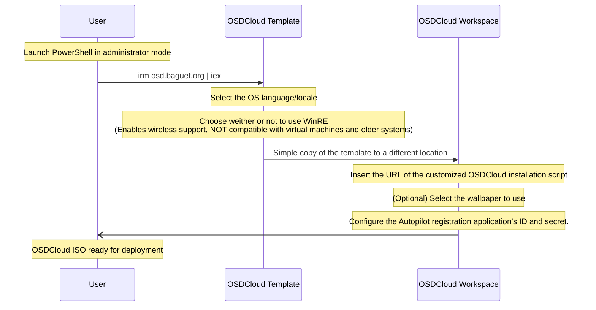

Working on one of my Microsoft Intune projects, I needed to set up an infrastructure for deploying Windows workstations registered on Autopilot.

This project had to respect several constraints, mainly:
- As little interaction as possible by a technician or user with the workstation
- A fully automatic, reliable and deterministic process
- Flexibility to enable modifications to be performed with ease (change Windows version 22H2, 22H3, etc.)

The traditional way was to use Microsoft Deployment Toolkit (MDT) on a Windows server. However, having done this in the past, this infrastructure is yet another labyrinthine system, as well as being hellish to maintain:
- 🤢 Adding new ISOs by hand
- 🤮 Each modification requires navigating Microsoft's appalling graphical interface
- 😒 Windows (eww)

In my quest for a better option, I came across [OSDCloud](https://www.osdcloud.com/), a Powershell module that automates the entire deployment of a Windows workstation.

Thus began my epic.

> While writing this article, I realized it was more convenient to divide it into two separate articles: 
> 1. [Using OSDCloud to automate the entire process of deploying a Windows workstation and registering it on Autopilot. (This article)](https://blog.baguet.org/posts/quit-using-microsoft-deployment-toolkit)
> 2. Setting up a PXE infrastructure to deploy Windows workstations with OSDCloud. (Coming soon)

## 🙌 OSDCloud, the sinews of war

There are many ways to use the OSDCloud Powershell module and I won't cover them all here. Nor am I going to explain all the details of the module, as there are plenty of articles on the Internet doing that perfectly.

A great starting point in my opinion would be (on top of the OSDCloud [documentation](https://www.osdcloud.com/)) Ákos Bakos' [series of articles](https://akosbakos.ch/tag/osdcloud/).

### OSDCloud main logic (Speedrun any% 🦔 (It's Sonic))
---

Once again, read docs and articles for more details but my workflows goes like this:
1. Create OSDCloud Template with `New-OSDCloudTemplate`
2. Create OSDCloud Workspace with `New-OSDCloudWorkspace`
3. Build the WinPE ISO with `Edit-OSDCloudWinPE`

### OSDCloud x Git
---

When WinPE starts up, OSDCloud lets you run a script from any URL  provided you use `-StartURL` parameter.

By combining this feature with a Git repository, you only need to build the OSDCloud ISO once, as the script will be loaded at each startup.

If the script needs to be modified, simply commit/push the change to the Git repository, and OSDCloud will load the new script via the repository URL.

> For this, we use the “raw” address of the script. Example with GitHub: `https://raw.githubusercontent.com/username/project/master/script.ps1`

---

The [script](https://git.baguet.org/nakama/yggdrasil/src/branch/master/Install-Windows.ps1) can be found on my git repository.

## 🧠 Uploading the hardware hash of a device from WinPE

Nowadays, uploading a device's hardware hash to Autopilot is easy. The simplest method (to date) is to use the Powershell [`Get-WindowsAutoPilotInfo`](https://www.powershellgallery.com/packages/Get-WindowsAutoPilotInfo) module with the `-online` parameter, and then everything will just fall into place.

However, it is not possible to obtain the hardware hash because the official Microsoft script uses a WMI Class (MDM_DevDetail_Ext01) which is not present in WinPE.

The solution, found by MICHAEL NIEHAUS in his blog post, is to use the OA3 Tool (oa3tool.exe is provided by the ADK which is normally already installed if you have installed OSDCloud).
OA3 Tool enables the creation of audit reports on the computer's hardware, and can therefore be used to retrieve the hardware hash.

---

Finally, there's the matter of importing this hash into Intune's Autopilot platform.

Many approaches are available, some of which cost a certain amount of money (albeit very little).

Nevertheless, one of my constraints is not to pay a single cent (not my choice, not my authority either 😢).

The best solution I've found so far is to use an Azure application with the right to add hardware hashes to Autopilot and store the application's identifiers (id and secret) in a configuration file within the ISO.

This method has the advantage of not leaking the secret inside the script (whether it's on a public repository or not, it's still good practice). The ISO itself will never be put on a USB key and will only be placed in a secure VLAN for deployment via PXE, so the risk of it leaking is extremely limited. And even if the secret does leak out, the risk surface is minimal, as the application's only rights are to add hardware hashes to Autopilot.

---

The [full script](https://git.baguet.org/nakama/yggdrasil/src/branch/master/Upload-AutopilotHash.ps1) can be found on my git repository.

## 🌳 Yggdrasil

In order to simplify the whole OSDCloud ISO creation process, I have decided to create a TUI wrapper around the functions I use to generate my ISO : [Yggdrasil](https://git.baguet.org/nakama/yggdrasil/)

I strongly encourage you to read the README, but here's a diagram explaining how it works :

